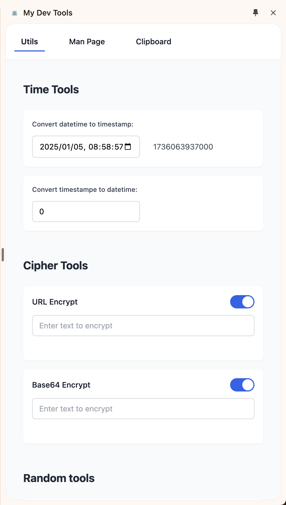
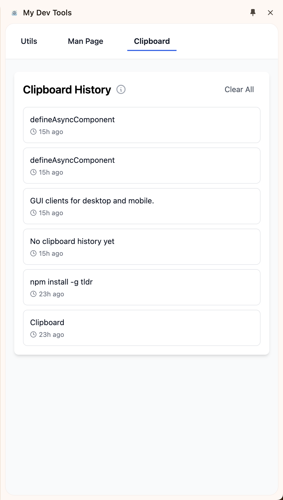

# MyDevTools

My first chrome extension for my dev tools

## The Purpose

Providing the common tools for developers.

## Integrated Tools

### Cipher tools

- URL escape & unescap
- Base64 encode & decode
- Hash function

### Random tools

- Select a random item from a list

### Time tools

- timestamp to datetime (UTC)
- datetime (UTC) to timestamp

### Man pages

- search command usages

### Clipboard History

- Show latest 50 copied records in chrome

## Screenshots

## TODO List

- Binary Tools
- JSON string <=> Java Plain Object
- Typescript object <=> Java Plain Object
